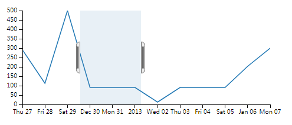
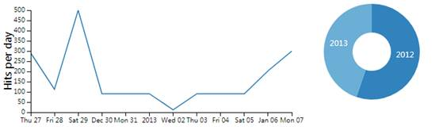
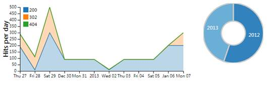
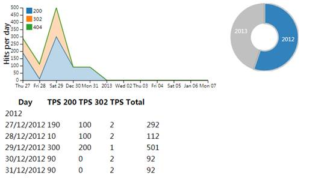

#dc.js入门教程

**作者**：The Myth

**翻译&注释**：段青青，李昕

**版权**：中国石油大学（华东）可视分析小组

**网页原址**：

https://www.codeproject.com/Articles/697043/Making-Dashboards-with-Dc-js-Part-2-Graphing

###1. 背景

DC.js依赖于其他两个JavaScript插件库:[D3.js](http://d3js.org/)和[Crossfilter js](http://square.github.io/crossfilter/)。

[D3.js](http://d3js.org/)是Protovis的进化。在D3出现之前，大多数基于浏览器的图形是静态(Protovis)或基于非javascript插件的，例如Flash或Java。这些图形隐藏了底层代码，不可能通过新功能进行更改，也不可能在没有插件的情况下使用。但是D3.js基于浏览器的原生JavaScript和SVG，因此可以看到它是如何操纵在DOM对象。对D3.js来说，现在更容易使图形进行交互。

D3.js可以让你制作很酷的图形，但它不是一个图形库。D3.js将建立和操作坐标系、坐标轴和形状；但它不知道什么是柱状图或饼图。 因此Dc.js出现了。Dc.js在D3.js对象的基础上定义了折线图，柱状图、饼图等，因此它更容易专注于如何渲染图形，而不是渲染的细节。

关于[Crossfilter.js](http://square.github.io/crossfilter/)的使用，请参考[Crossfilter.js入门教程](../crossfilterTutorial.html) 。

###2. 介绍

Dc.js是一个用来在JavaScript中制作交互式Dashboard的JavaScript库。通过选择不同图表进行过滤，从而发现特定的事件。

本教程使用`dc.js`渲染图表，并制作一个简单的交互式`dashboard`。

###3. 使用方法

####3.1. 准备

现在开始使用的`dc.js 2.0`的例子创建一个图形，从而了解其使用方法。由于需要使用`d3.js`，确保你在你的头部标签中使用了下面的元标签，因为`dc.js`依靠`d3`和`crossfilter` ，我们需要确保这些引用。这里也需要添加`jquery` ，因为你永远不知道你什么时候会需要它。同样，dc样式表也是必须添加的，否则图形会看起来有点奇怪。

```javascript
<meta http-equiv="content-type" content="text/html; charset=UTF8"> 
  
<script type="text/javascript" src="/static/lib/js/jquery.min.js"></script>
<script type="text/javascript" src="/static/lib/js/d3.min.js"></script>
<script type="text/javascript" src="/static/lib/js/crossfilter.js"></script>
<script type="text/javascript" src="/static/lib/js/dc.js"></script>

<link rel="stylesheet" type="text/css" href="/static/lib/css/dc.min.css" media="screen" />  
```

为了展示一个特定的场景，我们将从一个特定的数据集开始。

下面的数据是服务器受到点击后的响应。我们采用这个数据画一个简单的折线图，显示每天有多少次点击，有些是有效的(200)，有些是重定向(302)，有些是断链(404)。

```javascript
var data = [
		{date: "12/27/2012", http_404: 2, http_200: 190, http_302: 100},
		{date: "12/28/2012", http_404: 2, http_200: 10, http_302: 100},
		{date: "12/29/2012", http_404: 1, http_200: 300, http_302: 200},
		{date: "12/30/2012", http_404: 2, http_200: 90, http_302: 0},
		{date: "12/31/2012", http_404: 2, http_200: 90, http_302: 0},
		{date: "01/01/2013", http_404: 2, http_200: 90, http_302: 0},
		{date: "01/02/2013", http_404: 1, http_200: 10, http_302: 1},
		{date: "01/03/2013", http_404: 2, http_200: 90, http_302: 0},
		{date: "01/04/2013", http_404: 2, http_200: 90, http_302: 0},
		{date: "01/05/2013", http_404: 2, http_200: 90, http_302: 0},
		{date: "01/06/2013", http_404: 2, http_200: 200, http_302: 1},
		{date: "01/07/2013", http_404: 1, http_200: 200, http_302: 100}
		];
        
var ndx = crossfilter(data); 
```

现在，当我们开始处理日期时，我们需要确定`dc.js`知道这是一个日期。制定日期的方法有很多，我们需要告诉它如何对数据进行交互。在这里，我们循环遍历数组中的每个条目，并将日期设置为实际的日期类型。你可以看到这里的解析，一些d3.js通过d3.time.format类进入我们的代码。因为需要一个汇总total列，所以这里添加了这一列。`print_filter`是一个打印函数，详细代码参考[Crossfilter.js入门教程](../crossfilterTutorial.html) 。

```javascript
var parseDate = d3.time.format("%m/%d/%Y").parse;

data.forEach(function(d) {
	d.date = parseDate(d.date);
	d.total= d.http_404+d.http_200+d.http_302;
});
print_filter("data");  
```

输出结果为：

```javascript
"data(12) = [
	{"date":"2012-12-27T05:00:00.000Z","http_404":2,"http_200":190,"http_302":100,"total":292},
	{"date":"2012-12-28T05:00:00.000Z","http_404":2,"http_200":10,"http_302":100,"total":112},
	{"date":"2012-12-29T05:00:00.000Z","http_404":1,"http_200":300,"http_302":200,"total":501},
	{"date":"2012-12-30T05:00:00.000Z","http_404":2,"http_200":90,"http_302":0,"total":92},
	{"date":"2012-12-31T05:00:00.000Z","http_404":2,"http_200":90,"http_302":0,"total":92},
	{"date":"2013-01-01T04:00:00.000Z","http_404":2,"http_200":90,"http_302":0,"total":92},
	{"date":"2013-01-02T04:00:00.000Z","http_404":1,"http_200":10,"http_302":1,"total":12},
	{"date":"2013-01-03T04:00:00.000Z","http_404":2,"http_200":90,"http_302":0,"total":92},
	{"date":"2013-01-04T04:00:00.000Z","http_404":2,"http_200":90,"http_302":0,"total":92},
	{"date":"2013-01-05T04:00:00.000Z","http_404":2,"http_200":90,"http_302":0,"total":92},
	{"date":"2013-01-06T04:00:00.000Z","http_404":2,"http_200":200,"http_302":1,"total":203},
	{"date":"2013-01-07T04:00:00.000Z","http_404":1,"http_200":200,"http_302":100,"total":301}
]"  
```

这个例子中`crossfilter`使用的`dimension`最终会是x轴。因为我们希望x轴是一个时间轴，我们将创建一个日期`dimension`。对于y轴，想要显示总点击数，为此我们需要设置一个键值格式，我们可以用一个group函数来做这件事情。

```javascript
var dateDim = ndx.dimension(function(d) {return d.date;});
var hits = dateDim.group().reduceSum(function(d) {return d.total;}); 
```

> `dc`有一个很好的函数，通过使用`dc.pluck`代替内联函数来缩短一点语法。

```javascript
var hits = dateDim.group().reduceSum(dc.pluck('total')); 
```

最后还要设置x轴的范围。为此，我们需要获取日期的最小值和最大日期。我们可以通过使用`crossfilter`的`bottome`和`top`函数来获得这个日期列的底部值和顶部值。

```javascript
var minDate = dateDim.bottom(1)[0].date;
var maxDate = dateDim.top(1)[0].date;
```

以`minDate`为例介绍一下这个语法。bottom函数返回dateDim这个dimension中的n条最小的记录。而参数1表示n为1。因此最小的一条记录被获取。但是bottom函数返回结果是一个列表，因此用[0]得到这个列表中唯一的一条记录。最后用`.date`得到这条记录中的日期数据。

####3.2. 简单的折线图

为了使用数据集，需要先设置图表。首先设置一个DOM元素。这个DOM元素需要在所有JavaScript之前加载，这意味着，它需要首先放在页面的开始部分，或者需要将JavaScript代码封装到JQuery中，因为这样的代码在整个页面加载完成后才会被加载。

```html
<div id="chart-line-hitsperday"></div>
```

然后将dc的图表与DOM元素关联起来

```javascript
var hitslineChart  = dc.lineChart("#chart-line-hitsperday"); 
```

对图表设置图形的宽高、dimension(x轴)、group(y轴)以及x轴的数据范围。

```javascript
hitslineChart
	.width(500).height(200)
	.dimension(dateDim)
	.group(hits)
	.x(d3.time.scale().domain([minDate,maxDate])); 
```

最后进行渲染。

```javascript
dc.renderAll(); 
```

效果图如下：



[详细示例](./example1.html)

您会注意到，您不能在图中停留在一个点上，以查看它的值。相反，你会得到一个选择器对象。这被称为brush。默认情况下是打开状态。我们可以通过将以下内容添加到图表属性中来关闭它。

```javascript
.brushOn(false)
```

对于打开状态的brush，可以在横轴上进行筛选(filter)。通过改变左右手柄改变筛选的范围，并可以拖动整个筛选范围。当需要显示全部数据时，只需要在brush外部点击一下鼠标即可。

####3.3. 两个图表的互动

通过以下代码可以给y轴设置一个标签:

```javascript
.yAxisLabel("Hits per day")  
```

如果你注意到日期，本文数据跨度为2年。现在要在dashboard上添加一个饼状图，它向我们展示了每年的总点击量，然后允许我们选择其中的一年。首先，我们需要为我们创建一个year列。

```javascript
data.forEach(function(d) {
	d.date = parseDate(d.date);
	d.total= d.http_404+d.http_200+d.http_302;
    d.Year=d.date.getFullYear();
}); 
```

接下来，在year列上创建dimension，并对total数据采用group进行汇总。

```javascript
var yearDim  = ndx.dimension(function(d) {return +d.Year;});
var year_total = yearDim.group().reduceSum(function(d) {return d.total;});
```

在这些信息的基础上，创建DOM对象，并绘制饼图。这里使用的图表是piechart。

```javascript
<div id="chart-ring-year"></div>
var yearRingChart   = dc.pieChart("#chart-ring-year");
yearRingChart
    .width(150).height(150)
    .dimension(yearDim)
    .group(year_total)
    .innerRadius(30); 
```




[详细示例](./example2.html)

这两张图表是通过crossfilter相互联系的，不需要额外的代码！当在折线图上变化brush的时候，饼图会跟随变化。同样，当选取饼图上的不同年时，折线图也会跟随变化。

####3.4. 堆叠图

因为我们拥有了所有的数据，所以浪费这些数据似乎是一件很遗憾的事情。让我们进一步提高图表的内容。我们将为每个状态类型创建一个单独的group，而不是一个单独的total列的group。

```javascript
var status_200=dateDim.group().reduceSum(function(d) {return d.http_200;});
var status_302=dateDim.group().reduceSum(function(d) {return d.http_302;});
var status_404=dateDim.group().reduceSum(function(d) {return d.http_404;});
```

然后用status_200替换原来的total的group，并将其他group堆叠在一起。第二个参数设置了这个系列的标签，所以我们将它缩短为状态值本身。为了让它看起来更漂亮一些，我们将把renderArea属性设置为true，将它切换到一个区域图。

最后，我们还会给它一个图例legend。这个图例需要一个图例对象，因此我们将创建一个，并将其放置在左上角，同时设置了每个图例单元的高度以及图例之间的间隔。

```javascript
hitslineChart
   .width(500).height(200)
   .dimension(dateDim)
   .group(status_200,"200")
   .stack(status_302,"302")
   .stack(status_404,"404")   
   .renderArea(true)
   .x(d3.time.scale().domain([minDate,maxDate]))
   .brushOn(false)
   .legend(dc.legend().x(50).y(10).itemHeight(13).gap(5))
   .yAxisLabel("Hits per day");
```



[详细示例](./example3.html)

####3.5. 表格

我们已经讨论了两个相互影响的图形。然而dc.js不仅仅是关于图形的。它也可以做表格。大多数其他的可视化库是不包括表格这样的工具的。

要创建一个表，我们首先需要为它创建一些结构，因此它不像前文介绍的图形那样简单的给定一个div就可以了。图表标题也不包括在呈现的div中。

在封装div中加入了一些样式，这样它就不会与图表重叠。然后设置了表标题行和一个id，就可以用dc引用了。

```html
<div style='clear:both;'>
		<table id="dc-data-table">
			<thead>
			<tr class="header">
				<th>Day</th>
				<th>TPS 200</th>
				<th>TPS 302</th>
                <th>TPS 404</th>
				<th>TPS Total</th>
			</tr>
			</thead>
		</table>
</div> 
```

与前面的图形类似，这个图表引用了它与之关联的DOM对象，并给它一个dimension和一个group。在本例中，该group用于组织表数据，详见下面的示例。没有group就会只剩下一个扁平的datatable。下一个属性是column。确保列值与我们在header中设置的值保持一致

```javascript
var datatable   = dc.dataTable("#dc-data-table");
datatable
    .dimension(dateDim)
    .group(function(d) {return d.Year;})
    // dynamic columns creation using an array of closures
    .columns([
        function(d) { return d.date.getDate() + "/" + (d.date.getMonth() + 1) + "/" + d.date.getFullYear(); },
        function(d) {return d.http_200;},
        function(d) {return d.http_302;},
        function(d) {return d.http_404;},        
        function(d) {return d.total;}
    ]);
```

现在您应该能够看到表呈现并对图表中的更新作出反应了！



[详细示例](./example4.html)


联系人：李昕                              邮箱：[lix@upc.edu.cn](mailto:lix@upc.edu.cn)

 

 

 

 